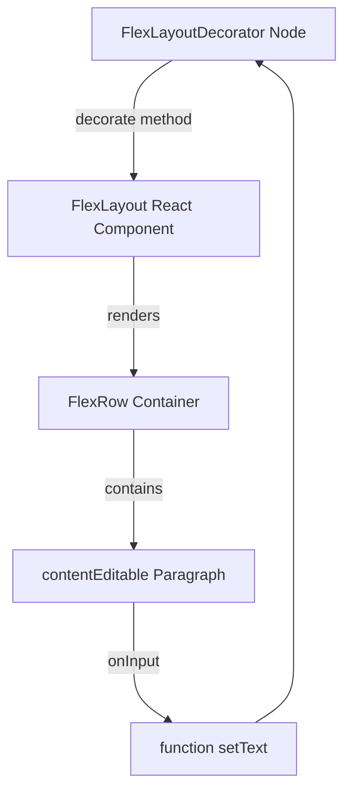

## Caveats

Since the contentEditable `
` is a child of `<FlexLayout />`, it is not represented as Lexical `ParagraphNode`. Instead, everything rendered by `<FlexLayout />` is represented as a single `FlexLayoutDecoratorNode`
